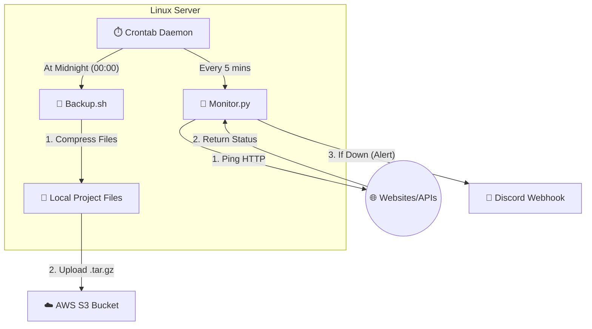

# 🛡️ Automated Server Monitoring & Disaster Recovery

A production-grade automation suite designed to ensure high availability and data integrity for Linux servers. This project implements **Real-Time Observability** via Discord and **Automated Off-Site Backups** using AWS S3.


## 🏗️ Architecture



The system consists of two autonomous daemons:
1.  **The Watchdog (Python):** Monitors HTTP endpoints every 5 minutes. If a service (e.g., website, API) goes down, it triggers an instant alert to a Discord channel via Webhook.
2.  **The Safety Net (Bash):** Runs nightly at 00:00. It compresses critical project files and uploads them securely to an AWS S3 bucket for disaster recovery.

## 🚀 Features

* **Real-Time Downtime Alerts:** Immediate notification to mobile/desktop via Discord.
* **Automated Disaster Recovery (DR):** "Set and forget" backups to the Cloud.
* **Secure Configuration:** Uses `.env` environment variables to protect API keys and credentials.
* **Self-Healing:** Runs as a background daemon using Linux Crontab.
* **Cloud Integration:** Native integration with AWS CLI v2 for S3 storage.

## 🛠️ Tech Stack

* **Scripting:** Python 3 (Requests), Bash Shell
* **Cloud:** AWS S3 (Simple Storage Service)
* **Automation:** Linux Crontab (Cron)
* **Notifications:** Discord Webhooks
* **Security:** Python-dotenv

## ⚙️ Setup & Installation

### 1. Prerequisites
* Linux Server (Ubuntu/Debian) or WSL
* Python 3.x
* AWS CLI v2 installed and configured

### 2. Clone the Repository
```bash
git clone [https://github.com/nuafal/uptime-monitor-automation.git](https://github.com/naufallofty/uptime-monitor-automation.git](https://github.com/nuafal/uptime-monitor-automation.git)
