# 🛡️ Automated Server Monitoring & DObservability Dashboard

A production-grade, containerized automation suite designed to ensure high availability for web services. This project evolved from a simple Python watchdog into a **Full-Stack Observability Dashboard** with Docker orchestration, CI/CD pipelines, and global tunneling.


## 🏗️ Architecture

```mermaid
graph TD
    %% 1. CI/CD Pipeline
    subgraph Pipeline [DevOps Pipeline]
        Dev[💻 You] -->|Git Push| GitHub[🐙 GitHub Repo]
        GitHub -->|Trigger| Actions[⚙️ GitHub Actions]
        Actions -->|Build & Push Image| DockerHub[🐳 Docker Hub]
    end

    %% 2. Core Server Components
    subgraph Production [Production Server - WSL/Linux]
        DockerHub -.->|docker compose pull| Compose[📦 Docker Compose]
        Node[🟢 Node.js Watchdog]
        DB[💾 config/history.json]
        UI[📊 src/dashboard.html]
        Cron[⏱️ Linux Cron]
        Backup[📜 scripts/backup.sh]
    end

    %% 3. External Services
    Internet((🌐 Target Websites))
    Discord[📢 Discord Webhook]
    AWS[☁️ AWS S3 Bucket]
    Tunnel[🥷 Ngrok Tunnel]
    PublicViewer[📱 Remote Access]

    %% --- Logic Flow Connections ---
    
    Compose -->|Starts| Node
    
    %% Monitoring Loop
    Node -->|1. Ping HTTP| Internet
    Node -->|2. Save Data| DB
    Node -->|3. Generate Chart| UI
    Node -->|4. Send Alert If Down| Discord
    
    %% Backup Loop
    Cron -->|Nightly Trigger| Backup
    Backup -->|Zip Config & Src| AWS

    %% Viewing
    Tunnel -->|Forward Port 9090| UI
    PublicViewer -->|Secure HTTPS| Tunnel
```



The system consists of three core components:
1. **The Watchdog (Node.js & Docker):** A containerized daemon that monitors HTTP endpoints continuously. It records latency metrics, dynamically generates a web dashboard, and triggers instant alerts to a Discord channel via Webhook if a service goes down.
2. **The Observability UI (Chart.js & Ngrok):** A responsive, dark-mode enabled HTML dashboard that visualizes server health and latency trends in real-time, exposed securely to the public internet via an Ngrok reverse-proxy tunnel.
3. **The Safety Net (Bash & AWS S3):** A scheduled Linux cron job that runs nightly at 00:00 to compress critical project files and configurations, uploading them securely to an AWS S3 bucket for disaster recovery.

## 🚀 Features

* **Interactive Live Dashboard:** Real-time latency tracking with Chart.js, featuring a dynamic Dark/Light mode toggle and system health metrics (RAM/Uptime).
* **Containerized & Portable:** Fully containerized using Docker and orchestrated with Docker Compose for guaranteed consistency across any Linux environment.
* **Global Access Tunneling:** Bypasses local firewalls to provide a secure, permanent public URL for remote monitoring via Ngrok.
* **Real-Time Downtime Alerts:** Immediate notifications to mobile/desktop via Discord Webhooks.
* **Automated Disaster Recovery (DR):** "Set and forget" nightly `.tar.gz` backups to the Cloud.
* **Continuous Integration (CI/CD):** Automated Docker image builds pushed to Docker Hub via GitHub Actions upon every repository commit.

## 🛠️ Tech Stack

* **Backend Scripting:** Node.js (Axios, fs), Bash Shell
* **Frontend UI:** HTML5, CSS3, Chart.js
* **Containerization:** Docker, Docker Compose
* **CI/CD Pipeline:** GitHub Actions, Docker Hub
* **Cloud & DR:** AWS S3 (Simple Storage Service), AWS CLI v2
* **Networking:** Ngrok (Reverse Proxy Tunneling)
* **Notifications:** Discord Webhooks
* **Security:** `dotenv` for strict environment variable management

## ⚙️ Setup & Installation

### 1. Prerequisites
* Linux Server (Ubuntu/Debian) or WSL
* Python 3.x
* AWS CLI v2 installed and configured

### 2. Clone the Repository
```bash
git clone [https://github.com/nuafal/uptime-monitor-automation.git](https://github.com/naufallofty/uptime-monitor-automation.git](https://github.com/nuafal/uptime-monitor-automation.git)
